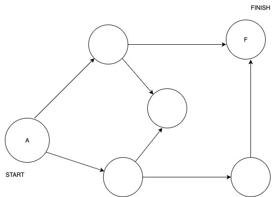
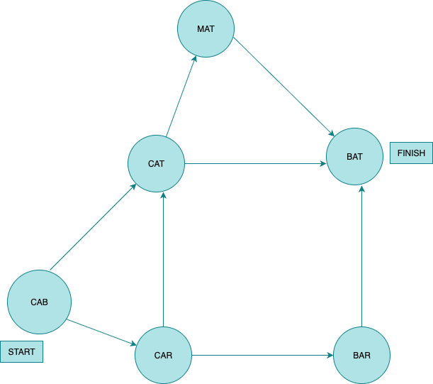

# Problem Statement

## Run the breadth-first search alogirthm on each of these graphs to find the solution.

### 6.1 Find the length to the shortest path from start to finish.

Answer:
The shortest path length is ``2``.

### 6.3 Find the lenght of the shortest path from "cab" to "bat"

Answer:
The shortest path length is ``3``.