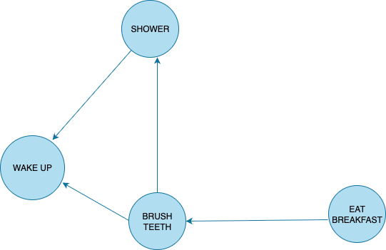
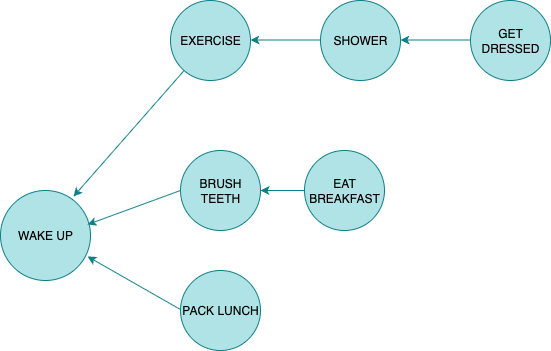

# Problem Statement

## Run the breadth-first search alogirthm on each of these graphs to find the solution.

### 6.1 Find the length to the shortest path from start to finish.

Answer:
The shortest path length is ``2``.

### 6.2 Find the lenght of the shortest path from "cab" to "bat"

Answer:
The shortest path length is ``2``.

## Here is a small graph of my morning rutine

It tells you that I cannot eat breakfast unitl I have brushed my teeth. So "eat breakfast" depends of "brush teeth".

On the other hand showering doesn't depent on brushing my teeth, because I can shower before I brush my teeth. From this graph, you can make a list of the order in which I need to do my morning routine:
1. Wake up.
2. Shower.
3. Brush teeth.
4. Eat breakfast.

Note that "shower" can be moved around, so this list is also valid:
1. Wake up.
2. Brush teeth.
3. Shower.
4. Eat breakfast.

### 6.3 For these three lists, mark wether one is valid or invalid
A) 
1. Wake up.
2. Shower.
3. Eat breakfast.
4. Brush teeth.

B) 
1. Wake up.
2. Brush teeth.
3. Eat breakfast.
4. Shower.

C) 
4. Shower.
2. Wake up.
3. Brush teeth.
4. Eat breakfast.

`` A an C are invalid, B is valid ``

### 6.4 Here's a larger graph. Make a valid list for this graph.

You could say that this is sorted, in a way. If task A depends on task B, task A shows later in the list. This is called a topological sort, and it's a way to make an ordered list out of a graph. Suppose you're planning a wedding and have a large graph full of tasks to do - and you're not sure where to start. You could topologically sort the graph and get a list of tasks to do, in order.

1. Wake up.
2. Exercise.
3. Shower.
4. Brush teeth.
5. Get dressed.
6. Pack lunch.
7. Eat breakfast.

