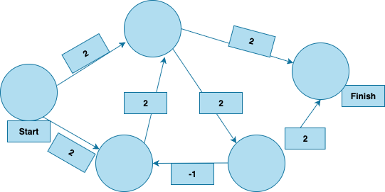

# Problem Statement

## 7.1 In each of these graphs, what is the weight of the shortest path from start to finish?

`` A ``
Answer:
The shortest path is `8`.

`` B ``
The shortest path is `60`.

`` C ``
Disjkstra's diagram cannot be implemented on negative numbers