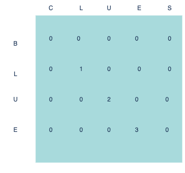

# Problem Statement

### 9.1 Suposse you can steal another item: an MP3 player. It weights 1lb and is worth is $1000. Should you steal it?
`` Yes. Then you could stea the MP3 player, the Iphone, and the guitar, worth a total of $4500 ``

### 9.2 Suppose you are going camping. You have a knapsack that will hold 6lb, and you can take the following items. Each has a value, and the higher the value, the more important the item it is:
* Water, 3lb, 10
* Book, 1lb, 3
* Food, 2lb, 9
* Jacket, 2lb, 5
* Camera, 1lb, 6

### What is the optimal set of items to take on your camping trip?
`` Water, Food and a Camera ``

### 9.3 Draw and fill in the grid to calculate the longest common substring between blue and clues
